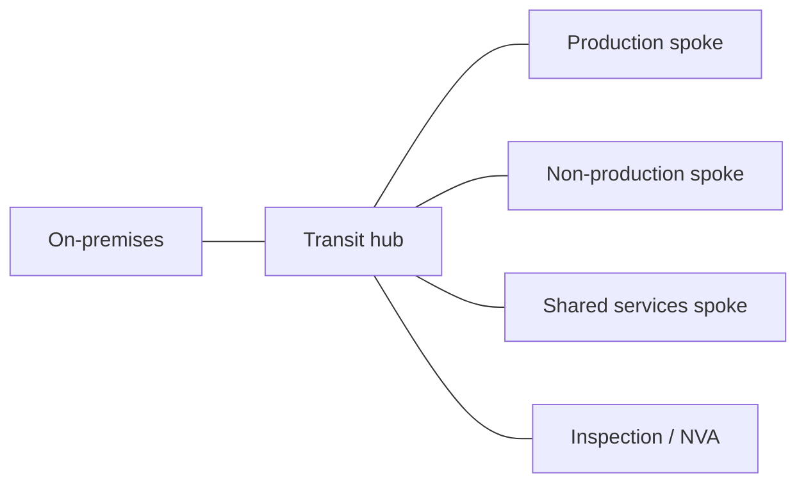

Hub-and-spoke is the backbone of almost every landing zone: a central transit point that connects workload networks, on-premises connectivity and traffic inspection. All three providers offer a managed service for it, but their routing models differ.

## The common pattern



## Quick comparison

| Aspect | AWS | Azure | GCP |
|---|---|---|---|
| Service | Transit Gateway | Virtual WAN (hub) | Network Connectivity Center |
| Scope | Regional (inter-region peering) | Regional hub, managed mesh between hubs | Global hub |
| Segmentation | TGW route tables | Virtual hub route tables | Spoke groups and export filters |
| Hybrid connectivity | Direct Connect, VPN | ExpressRoute, VPN | Interconnect, HA VPN |

## Creating it from the CLI

### AWS

Disabling default association and propagation forces you to design route tables explicitly, which is what you want when segmenting environments.

```bash
aws ec2 create-transit-gateway \
  --description "tgw-hub-euw1" \
  --options AmazonSideAsn=64512,AutoAcceptSharedAttachments=disable,DefaultRouteTableAssociation=disable,DefaultRouteTablePropagation=disable \
  --region eu-west-1
```

### Azure

```bash
az network vwan create --name vwan-core --resource-group rg-network --location westeurope --type Standard
az network vhub create --name vhub-weu --resource-group rg-network --vwan vwan-core \
  --address-prefix 10.100.0.0/23 --location westeurope
```

### Google Cloud

```bash
gcloud network-connectivity hubs create hub-core --description="Global hub"
gcloud network-connectivity spokes linked-vpc-network create spoke-prod \
  --hub=hub-core \
  --vpc-network=projects/PROJECT/global/networks/vpc-prod \
  --global
```

## What changes in practice

On AWS and Azure the hub is regional, and inter-region connectivity is designed explicitly (Transit Gateway peering or multiple virtual hubs). On Google Cloud the VPC is already global, so NCC focuses on connecting VPCs to each other and to the hybrid network rather than stitching regions together.

Traffic inspection differs too. On AWS you usually place an inspection VPC with Network Firewall or third-party appliances behind Gateway Load Balancer. On Azure, Virtual WAN supports Azure Firewall or NVAs inside the hub. On GCP, appliances integrate as NCC spokes.

## Official documentation

- [AWS Transit Gateway](https://docs.aws.amazon.com/vpc/latest/tgw/what-is-transit-gateway.html)
- [Azure Virtual WAN](https://learn.microsoft.com/azure/virtual-wan/virtual-wan-about)
- [Network Connectivity Center](https://cloud.google.com/network-connectivity/docs/network-connectivity-center/concepts/overview)
