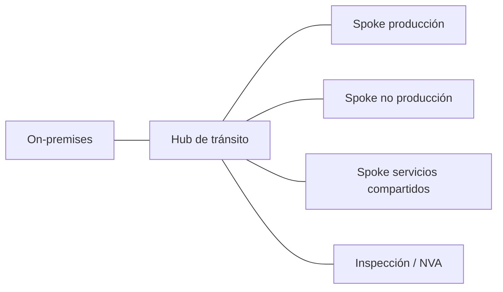

El patrón hub-and-spoke es la base de casi cualquier landing zone: un punto central de tránsito al que se conectan las redes de carga de trabajo, la conectividad on-premises y la inspección de tráfico. Los tres proveedores lo resuelven con servicios gestionados, pero con modelos de enrutamiento distintos.

## El patrón común



## Comparativa rápida

| Aspecto | AWS | Azure | GCP |
|---|---|---|---|
| Servicio | Transit Gateway | Virtual WAN (hub) | Network Connectivity Center |
| Ámbito | Regional (peering entre regiones) | Hub regional, malla gestionada entre hubs | Hub global |
| Segmentación | Tablas de rutas del TGW | Tablas de rutas del hub virtual | Grupos de spokes y filtros de exportación |
| Conectividad híbrida | Direct Connect, VPN | ExpressRoute, VPN | Interconnect, HA VPN |

## Creación desde la CLI

### AWS

Desactivar la asociación y propagación por defecto obliga a diseñar las tablas de rutas de forma explícita, que es lo que quieres para segmentar entornos.

```bash
aws ec2 create-transit-gateway \
  --description "tgw-hub-euw1" \
  --options AmazonSideAsn=64512,AutoAcceptSharedAttachments=disable,DefaultRouteTableAssociation=disable,DefaultRouteTablePropagation=disable \
  --region eu-west-1
```

### Azure

```bash
az network vwan create --name vwan-core --resource-group rg-network --location westeurope --type Standard
az network vhub create --name vhub-weu --resource-group rg-network --vwan vwan-core \
  --address-prefix 10.100.0.0/23 --location westeurope
```

### Google Cloud

```bash
gcloud network-connectivity hubs create hub-core --description="Hub global"
gcloud network-connectivity spokes linked-vpc-network create spoke-prod \
  --hub=hub-core \
  --vpc-network=projects/PROYECTO/global/networks/vpc-prod \
  --global
```

## Qué cambia en la práctica

En AWS y Azure el hub es regional y la conectividad entre regiones se diseña de forma explícita (peering entre Transit Gateways o varios hubs virtuales). En Google Cloud la VPC ya es global, así que NCC se centra en conectar VPCs entre sí y con la red híbrida, no en unir regiones.

La inspección de tráfico también difiere. En AWS se suele colocar una VPC de inspección con Network Firewall o appliances de terceros detrás de Gateway Load Balancer. En Azure, Virtual WAN admite Azure Firewall o NVAs dentro del hub. En GCP, los appliances se integran como spokes de NCC.

## Documentación oficial

- [AWS Transit Gateway](https://docs.aws.amazon.com/vpc/latest/tgw/what-is-transit-gateway.html)
- [Azure Virtual WAN](https://learn.microsoft.com/azure/virtual-wan/virtual-wan-about)
- [Network Connectivity Center](https://cloud.google.com/network-connectivity/docs/network-connectivity-center/concepts/overview)
